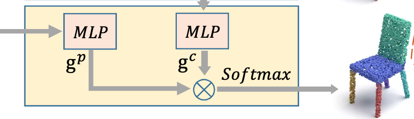
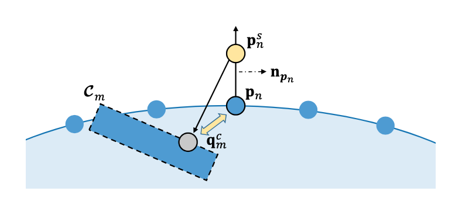

**Unsupervised Learning for Cuboid Shape Abstraction via Joint Segmentation from Point Clouds**
****
[Kaizhi Yang](https://arxiv.org/search/cs?searchtype=author&query=Yang%2C+K), [Xuejin Chen](https://arxiv.org/search/cs?searchtype=author&query=Chen%2C+X)

SIGGRAPH2021

USTC

---
::: # Introduction

--

::: ## Contributions

- Proposed an  unsupervised framework to do part-segmentation and cuboid-based shape abstraction
- Proposed a set of novel loss functions are designed to jointly supervise the two tasks without requiring manual annotations on parts or structural relationships.
- This framework supports shape generation, shape interpolation, and structural shape clustering

--

--

--

--

---
::: # Approach

--

- Cuboids:  $\mathcal{C}_i,i=1,\cdots,m$​​​​

  - translation $t\in \mathbb{R}^3$,quaternion $r\in\mathbb{R}^4$(rotation), scale $s\in \mathbb{R}^3$

  - Adding a indicator for each cuboid $\delta\in\\{0,1\\}$  to indicate whether this cuboid appears in an instance.

- $p_m = [t_m;r_m;s_m;\delta_m]$​

--

:::
- **Feature Embedding Network**
- **Shape Abstraction Network**
- **Cuboid-Associated Segmentation Network**

--

::: **Feature Embedding Network**

- **Input** : Point Cloud

- **Output** :
  1. Gaussian Generator $p_{\theta}(z|x)$ for Shape Abstraction Network
  2. Point Feature $f^p$ for Cuboid-Associated Segmentation Network

--

::: **Shape abstraction network**

- $z$: Sampled from Gaussian Generator $p_\theta(z|x)$
- $v$: ont-hot Initial Cuboid code $E_{cb}$​​​​​  : $v_m: v_{mj}=1$ if $j=m$ else  $0$

- $D_{cp}$ : Cuboid parameter prediction Module
  - Geometric Parameters
  - Existence Probability
- $E_{cb},E_{cf},D_{cp}$ : shared the parameters among all $M$​ Cuboids.

--

::: **Cuboid-associated segmentation network**

- **Input**: 
  1. Point Feature $f^p$​​ from Feature Embedding Network.

  2. Cuboid Feature from Shape abstraction network.

- **Output** : Segmentation of the input point cloud. 

--

::: **Cuboid-associated segmentation network**

<!-- .slide: class="master04" -->

- segmentation branch allocates each point in the input point cloud to 𝑀 cuboids.

- Treating these point features and cuboid features as the query and key in an attention scheme
  $$
  A_{mn} = g_m^c\cdot g_n^p
  $$
  Using a SoftMax Operation to get the probability of point $p_n$ belongs to the part that the cuboid $C_m$​ represents.
  $$
  W_{m,n} = \frac{\exp(g_m^c\cdot g_n^p)}{\sum_{m=1}^M\exp(g_m^c\cdot g_n^p)}
  $$
  

--

::: ## Loss Function

--

:::
- Reconstruction loss
- Cuboid compactness loss
- Cuboid existence los
- Latent code KL-divergence loss

--

::: **Reconstruction Loss**

<!-- .slide: class="master04" -->
$$
L_{recons} = \frac{1}{N}\sum_{n=1}^N\sum_{m=1}^M W_{m,n}d(p_n,\mathcal{C}_m)
$$

- Aims to reduce the geometric deviation for a point to the cuboid with high weight
  - Measures the compatibility of the segmentation branch with the abstraction branch

--
:::

$$
d(p_n,\mathcal{C}_m)  = |q_m^c-p_n|^2
$$
<!-- .slide: class="master04" -->

- Enhance the robustness to noises in point clouds
  - Sample a new point $p_n^s$ along the normal direction of $p_n$ with a  random distance $\epsilon\sim \mathcal{N}(0,\sigma_s^2)$
  - Find the nearest point $q_m^c$​ on the selected cuboid surface.

--

**Cuboid Compactness Loss.**

<!-- .slide: class="master04" -->

 A Small number of Cuboid is preferred for shape abstarction

- how many points likely to be allocated to each cuboid ?
  $$
  w_m = \frac{1}{N}\sum_{n=1}^N W_{m,n}
  $$

  - Therefore, we compute the compactness of the shape abstraction directly from $w_m$​ for each cuboid. 

--

- For Sparseness, Using $L_{0.5}$ Norm
  $$
  L_{compact}= (\sum_{m=1}^M\sqrt{w_m+\epsilon_{sps}})^2
  $$

  - The small constant $\epsilon_{sps} = 0.01$​ is added to prevent gradient explosion when a cuboid has no points allocated during training.

  

<!-- .slide: class="master04" -->

--

**Cuboid Existence Loss**

- we consider the portion of points allocated to each cuboid $w_m$​​​ after segmentation as its existence ground truth.

- Construct the truth of the coboid exsistance

  - if $w_m>\epsilon_{ext}$ : $\delta_m^{gt}=1$
  - Otherwise: $\delta_m^{gt}=0$

  $$
  L_{e x i s t}=-\frac{1}{M} \sum_{m=1}^{M}\left[\delta_{m}^{g t} \log \delta_{m}+\left(1-\delta_{m}^{g t}\right) \log \left(1-\delta_{m}\right)\right]
  $$

  

<!-- .slide: class="master04" -->

--

**Latent Code KL-divergence Loss**

- Actually, it is the KL-divergence of two Gaussian Distribution
  $$
  L_{K L-d i v}=\frac{1}{2} \sum_{k=1}^{512}\left[e^{\sigma_{k}}-\left(1+\sigma_{k}\right)+\mu_{k}^{2}\right]
  $$
  

<!-- .slide: class="master04" -->

--

**Training Loss**

- Loss
  $$
  L=L_{\text {recons }}+\lambda_{1} \cdot L_{\text {compact }}+\lambda_{2} \cdot L_{\text {exist }}+\lambda_{3} \cdot L_{K L-\text { div }}
  $$
  - $\lambda_1 = 0.1$
  - $\lambda_2 = 0.01$
  - $\lambda_3 = 6e^-6$

<!-- .slide: class="master04" -->

---

# Experiments and Analysis

<!-- .slide: class="master04 intro" -->

--

<!-- .slide: class="master04" -->

**Structured Shape Reconstruction**

- Compared Method
  - VP [Tulsiani et al. 2017]
  - HA [Sun et al. 2019]
- Metric Chamfer Distance 
  - Sampling Points from the generated model composed of parametric cuboids

--

<!-- .slide: class="master04" -->

--

<!-- .slide: class="master04" -->

--

<!-- .slide: class="master04" -->

--

<!-- .slide: class="master04" -->

<!-- .slide: class="master04" -->

--

**Shape co-segmentation**

- Compared Methods
  - VP [Tulsiani et al. 2017]
  - SQ [Paschalidou et al. 2019]
  - HA [Sun et al. 2019]
  - BAE-Net [Chen et al. 2019]
  - BSP-Net [Chen et al. 2020]

<!-- .slide: class="master04" -->

--

<!-- .slide: class="master04" -->

--

<!-- .slide: class="master04" -->

--

**Ablation study and analysis**

- Segmentation Module Analysis
- Point-to-cuboid distance
- Compactness Loss
- Choice of the cuboid number $M$​
- Robustness on sparse point clouds.

<!-- .slide: class="master04" -->

--

**Segmentation Module Analysis**

- P2C-Dis
  - Remove Segmentation Module, $W_{mn} = 1$ when $C_m$ is the closet cuboid of $p_n$​​ 
- Chamfer-Dis
  - Remove Segmentation Module, Using Bi-Chamfer Distance  to Compute $L_{recons}$​​
- P2C-Seg
  - Using Reconstruction Loss Only

<!-- .slide: class="master04" -->

--

<!-- .slide: class="master04" -->

--

**Point-to-cuboid distance**

- $\sigma_n$ : noise level
- $\sigma_s$: sampling parameters
- CD
- normal consistency

<!-- .slide: class="master04" -->

--

**Compactness Loss**

- $N_{AC}$ : number of cuboids

<!-- .slide: class="master04" -->

--

<!-- .slide: class="master04" -->

--

**Choice of the cuboid number $M$​**

<!-- .slide: class="master04" -->

--

**Robustness on sparse point clouds**

<!-- .slide: class="master04" -->

---

# Applications

<!-- .slide: class="master04 intro" -->

--

**Shape Generation**

<!-- .slide: class="master04" -->

--

**Shape interpolation**

<!-- .slide: class="master04" -->

--

**Structural shape clustering**

<!-- .slide: class="master04" -->

--

**Failure cases, limitation and future works**

1. Unique Structure
2. Over-Sparse Region
3. Excussive Parts

<!-- .slide: class="master04" -->

--

<!-- .slide: class="master04" -->

---

# End

<!-- .slide: class="master04 intro" -->